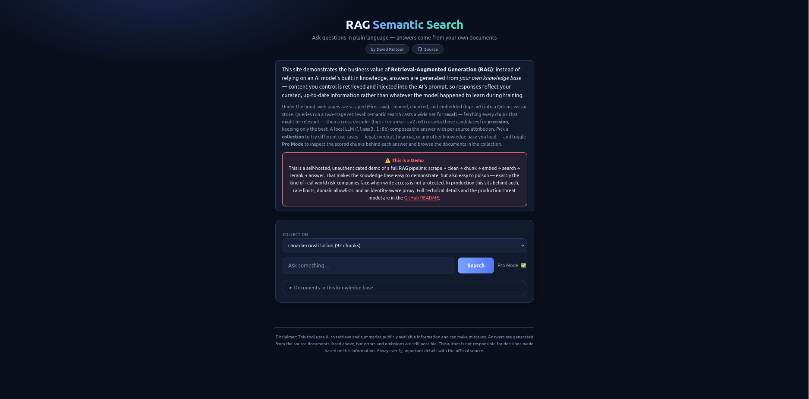
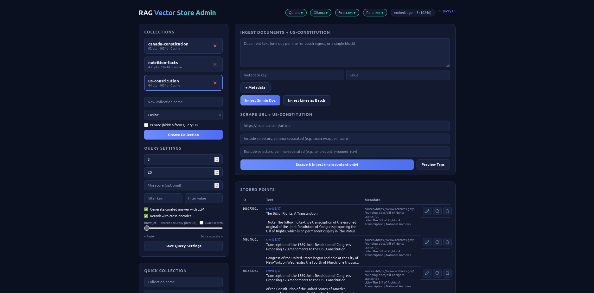

# RAG Semantic Search

A self-hosted retrieval-augmented generation (RAG) stack for querying your own knowledge base. Content is scraped from the web via Firecrawl, cleaned, chunked, embedded with Ollama, stored in Qdrant, reranked with a cross-encoder, and summarized by an LLM with per-source attribution. Collections can hold any domain — legal, medical, financial, travel, or anything else you load.

## Stack

| Service  | Port | Purpose                                       |
| -------- | ---: | --------------------------------------------- |
| qdrant   |    — | Vector DB (internal to Docker network)        |
| backend  | 8765 | FastAPI — scrape, chunk, embed, ingest, query |
| reranker |    — | bge-reranker-v2-m3 cross-encoder (internal)   |
| admin-ui | 8770 | Collections, scraping, document management    |
| query-ui | 8771 | Semantic search + curated LLM answers         |

External services: **Ollama** (embeddings + LLM, via `app-network`) and **Firecrawl** (self-hosted scraping API).

## Pipeline

1. **Scrape** — Admin UI posts a URL to Firecrawl; boilerplate is stripped via configurable include/exclude CSS selectors (`SCRAPE_INCLUDE_TAGS` / `SCRAPE_EXCLUDE_TAGS`), plus a markdown cleaner that removes images, ads, link-only lines, and duplicated blocks.
2. **Chunk** — cleaned markdown is split on paragraph boundaries (~1500 chars, 200 overlap); section headings are prepended to each chunk so every chunk is self-describing. All chunks of a page share a `doc_id`.
3. **Embed & store** — chunks are embedded (`bge-m3`, 1024d) and upserted to Qdrant with metadata (`source`, `title`, `line`, `topic`, …).
4. **Query** — vector search → optional cross-encoder rerank over a larger candidate pool → optional LLM curated answer with natural per-source attribution.

## Usage

Copy the example configuration:

```bash
cp .env.example .env
```

Review `.env` and adjust it for your environment. At minimum, verify the Ollama, Firecrawl, embedding model, and Qdrant settings.

Then start the stack:

```bash
docker compose up -d --build
```

* **Admin UI**: http://localhost:8770 — create collections (a **Private** toggle prefixes the name with `private-`, hiding it from the Query UI), ingest text, scrape URLs (with a "Preview Tags" selector picker), manage documents (edit re-chunks, refetch re-scrapes the source URL, delete removes all chunks of a doc), and tune **Query Settings**: top-k, candidate-k rerank pool, min similarity score, metadata filters, LLM answer, rerank, hnsw_ef slider, and exact search. Settings persist in `./data/backend/settings.json`.
* **Query UI**: http://localhost:8771 — pick a collection and ask questions in plain English. Curated answers include a numbered **Sources** list mapping `[n]` citations to their links. **Pro Mode** reveals the scored chunks behind each answer and a "Documents in this knowledge base" list. Mobile viewports get a desktop-required splash.
* **API docs**: http://localhost:8765/docs

### Screenshots





## Configuration

Configuration is loaded from `.env`. The repository includes `.env.example` as a starting point.

* `OLLAMA_URL`, `EMBED_MODEL`, `EMBED_DIM` — embedding model configuration
* `LLM_MODEL` — Ollama model for curated answers (default `llama3.2:latest`)
* `RERANKER_URL`, `RERANK_MODEL` — cross-encoder reranker; empty `RERANKER_URL` falls back to LLM scoring
* `FIRECRAWL_URL`, `FIRECRAWL_API_KEY` — self-hosted Firecrawl endpoint
* `SCRAPE_INCLUDE_TAGS`, `SCRAPE_EXCLUDE_TAGS` — default CSS selectors applied to every scrape (per-request overrides in the Admin UI)
* `QDRANT_HOST`, `QDRANT_PORT`, `QDRANT_API_KEY` — Qdrant connection
* `*_PORT` — host port mappings
* `CLOUDFLARE_TUNNEL_TOKEN` — token used by the included Cloudflare Tunnel service

`.env` is gitignored; commit `.env.example` only.

> `EMBED_DIM` must match the model's output size (`nomic-embed-text` = 768, `bge-m3` = 1024). Existing collections retain the dimension they were created with.

## Persistence

Qdrant data is bind-mounted to `./data/qdrant`; reranker model cache to `./data/reranker`; query settings to `./data/backend`. All survive container removal.

## Networking

Ollama and Firecrawl are reached via the external `app-network` Docker network. If your Ollama container isn't on it, either connect it:

```bash
docker network connect app-network ollama
```

or set:

```text
OLLAMA_URL=http://host.docker.internal:11434
```

and add:

```yaml
extra_hosts:
  - "host.docker.internal:host-gateway"
```

to the backend service.

## Cloudflare Tunnel

To expose the UI and API over the internet without opening inbound firewall ports, the Compose file includes a `cloudflared` service that starts with the rest of the stack.

1. In the [Cloudflare Zero Trust dashboard](https://one.dash.cloudflare.com/), create a new tunnel and copy its **token**.
2. Add the token to `.env`:

```bash
CLOUDFLARE_TUNNEL_TOKEN=<your-token>
```

3. Start or restart the stack:

```bash
docker compose up -d --build
```

> The `cloudflared` container starts with the rest of the stack and requires a valid `CLOUDFLARE_TUNNEL_TOKEN` to connect successfully.

4. In the tunnel's **Public Hostnames** settings, route each service to the container name on `rag-network`:

* `http://admin-ui:80` for the Admin UI
* `http://query-ui:80` for the Query UI
* `http://backend:8000` for the FastAPI backend / API docs

Cloudflare Tunnel connects outbound-only to the Cloudflare edge, so no inbound firewall rules are needed. Because the Admin UI has unauthenticated write access to the knowledge base, protect its hostname with **Cloudflare Access** before sharing it.

## Security & Threat Model

This demo is intentionally run without the controls that would be mandatory in production. That is a teaching choice, not an oversight.

The FastAPI backend exposes unauthenticated `POST/PUT/DELETE` routes for creating collections, ingesting text, scraping URLs, and editing points. CORS is set to `*` so the static Query UI can call the API directly from the browser. That means any client that can reach the backend port can write to the knowledge base, scrape arbitrary URLs, and consume Ollama, embedding, and reranker resources.

**Why that is acceptable here:**

* The demo is self-hosted, uses only publicly available input data, and contains no production, customer, or sensitive PII.
* This discussion highlights a real-world challenge experienced by companies: a RAG knowledge base with unauthenticated write access can be poisoned by anyone who can reach the API.
* The author's production system is separate and hardened.

**What a production deployment would require:**

Authentication and role separation, scoped scraping with a domain allowlist, rate limiting, egress filtering, audit logging, content review before ingestion, and placement of the admin/write paths behind an identity-aware proxy such as Cloudflare Access.
